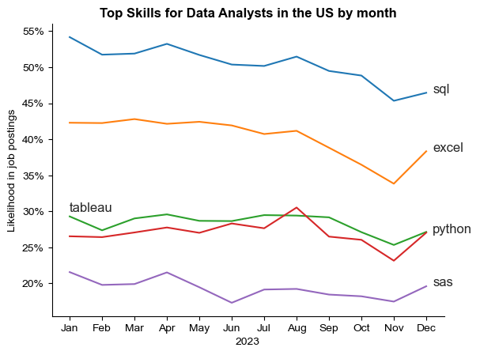

# Overview

Welcome to my analysis of the 2023 data job market, focusing on data analysts roles in the US with some comparision with the job market in Vietnam.
This project was created to navigate and understand the job market more effectively. It delves into the top paying and top demanded skills to help identify optimal job opportunities for data analysts.

Through a series of Python scripts, I find answers to key questions based on the data source here.

# The Questions
Below are the questions that I want to answer in this project:
1. What are the most demanded skills for top 3 most popular data jobs in the US and in Vietnam?
2. How are in-demand skills trending for Data Analyst in the US?
3. How well do jobs and skills pay?
4. What are the optimal skills for data analysts to learn? (high demand and high paying)

# Tools I used

- **Python**: 
    - Pandas Library
    - Matplotlib Library
    - Seaborn Library
- **Jupyter Notebooks**
- **Visual Studio Code**
- **Git & GitHub**

# The Analysis

1. What are the most demanded skills for top 3 most popular data jobs in the US and in Vietnam?

Data jobs in the US are very common. So I want to highlight the most popular jobs and most often required skills for these jobs in this country and have a comparison with the situation in Vietnam. This helps me to focus on skills most important to my job target.

### Methodology
 1. Filter data
 2. Clean up `job_skills` column 
 3. Calculate skill counts, job counts based on `job_title_short`
 4. Calculate skill percentage
 5. Plot final findings

View my notebook with details steps here:
[2_Skill_Demand.ipynb](Project\2_Skill_Demand.ipyn)

### Data Visualization
```python
fig, ax = plt.subplots(len(job_titles_US),1)

for i, job_title in enumerate(job_titles_US):
    df_final_US = df_skill_percent_US[df_skill_percent_US['job_title_short'] == job_title].head(5)

    sns.barplot(df_final_US, x='skill_percent', y='job_skills', ax=ax[i], hue='skill_percent', palette='dark:steelblue_r')

    ax[i].set_title(job_title)
    ax[i].legend ().set_visible(False)  
    ax[i].set_ylabel('')
    ax[i].set_xlabel('')
    ax[i].set_xlim(0,78)

    if i != len(job_titles_US)-1:
        ax[i].set_xticks([])

    for index, value in enumerate(df_final_US['skill_percent']):
        ax[i].text(value+1,index,f'{value:,.0f}%', va='center')

fig.suptitle('Likelihood of Skills Requested in Job Posting in the US', fontsize=15)
fig.tight_layout()
```
### Result


### Insights

SQL and Python are core skills in the data job markets of both the US and Vietnam. Overall, both countries have relatively similar demand for specific skills across each role:

* Data Analysts focus more on tools for data manipulation and visualization (Excel, Tableau, Power BI).
* Data Engineers require knowledge of cloud platforms.
* Data Scientists are expected to have expertise in statistical analysis (R, SAS).

Key differences between the two countries:

* SAS is highly demanded in the US, but not in Vietnam.
* In Vietnam, Power BI is slightly more popular than Tableau for Data Analysts.
* For Data Engineers, Azure is the 4th most required skill in the US, while in Vietnam, it's Java.
* For Data Scientists, SAS and Tableau are the 4th and 5th most requested skills in the US, while in Vietnam, Spark and TensorFlow are more in demand.


## 2. How are in-demand skills trending for Data Analyst in the US?

### Data visualization

```python
df_perc_plot = df_percent.iloc[:, :5]
sns.lineplot(df_perc_plot, dashes=False, legend='full', palette='tab10')

for i in range(5):
    if df_perc_plot.columns[i] == 'tableau':
        plt.text(0,30,df_perc_plot.columns[i]) 
    else:
        plt.text(11.2,df_perc_plot.iloc[-1,i],df_perc_plot.columns[i])

from matplotlib.ticker import PercentFormatter
ax = plt.gca()
ax.yaxis.set_major_formatter(PercentFormatter(decimals=0))

plt.show()
```
### Result


*Bar graph visualises the trending top skills for data analyst jobs in the US in 2023.*

### Insight
* SQL remains the most consistently demanded skill throught the year, followed by Excel.However, both skills show a gradual decrease in demand, with this trend being more noticeable in Excel.
* All 5 skills experienced a significant drop in November, followed by a rise right in the month after
* Tableau and Python show reletively stable demand with some fluctuations, but remains essential skills for data analysts.
* SAS while being the 5th most in-demand skills also indicates a gradual downward trend towards the year end.


## 3. How well do jobs and skills pay?

### Visualization

```python
sns.boxplot(df_US_top6, x= 'salary_year_avg', y = 'job_title_short', order=sorted_job_US,vert=False)
sns.set_theme(style='ticks')

ax=plt.gca()
ax.xaxis.set_major_formatter(plt.FuncFormatter(lambda x, pos: f'${int(x/1000)}K'))
plt.xlim(0,600_000)
```
### Result


*Box plot shows the distributions of yearly salary for top data jobs in the US and in Vietnam in 2023*

### Insight

In the US:
* There are significant variations in salary range across different job titles. Senior Data Scientist roles tend to have the highest salary potential, followed closely by Senior Data Enginner.
* Senior roles, and roles of Data Scientist and Data Engineer present a considerable number of outliers, suggesting that exceptional skills can lead to very high pay in these roles. Data Analyst seems to have a more consistent pay range, with fewer and closer outliers.
* The median salary also varies depending on level of seniority.

In Vietnam:
* The market for data job is small. Data Analyst and Data Engineer are the most popular roles, and the salary also increases with the level of seniority. 
* Like in the US, Data Engineer roles offer a higher range of salary compared to Data analysts. On the contrary, Data Scientist is not common in Vietnam, and has a lower pay range, just slightly higher than for Machine Learning Engineer.


## 4. What are the highest paid skills and top demanded skills and their salaries?

### Visualization

```python
fig,ax = plt.subplots(2,1)

# Top 10 Highest Paid Skills for Data Analysts
sns.barplot(df_DA_US_top_pay, x='median', y=df_DA_US_top_pay.index, ax=ax[0], hue='median', palette="dark:#5A9_r")

# Top 10 Most Popular Skills for Data Analysts
sns.barplot(df_DA_US_top_skill, x='median', y=df_DA_US_top_skill.index, ax=ax[1], hue='median', palette="light:#5A9")

fig.tight_layout(h_pad= 1)
```

### Result


*Bar chart shows the median yearly salary of the highest paid vs most demanded skills for Data Analyst in the US in 2023*

### Insight

- Top paid skills: Specialized skills like `dplyr`, `bitbucket`, `gitlab` are associated with higher salary which can go up to ~ $200K. This suggests that advanced technical proficiency can increase earning potential.
- Top popular skills: fundamental skills as `python`, `tableau`, `r`, `sql` are the most 4 skills in demand, even though they might not offer the highest range of salaries.
- There is a clear distinction between the skills with the highest pay range and the skills with the highest demand. Data analysts who aim at increase their earnings should develop diverse skills in terms of fundamental skills and high paying specialised skills.


## 5. What are the optimal skills for data analysts to focus on?

### Visualisation

```python
from adjustText import adjust_text

sns.scatterplot(df_plot, x = 'skill_percent', y = 'median_salary', hue='technology')

texts = []
for i, txt in enumerate(df_plot.index):
    texts.append(plt.text(df_plot['skill_percent'].iloc[i], df_plot['median_salary'].iloc[i],txt, ha='right', va='bottom')) 
adjust_text(
    texts,
    arrowprops = dict(arrowstyle = "->", color = 'grey', lw=1)
```

### Result


### Insight
- Most of `programming` skills (colored blue) tend to cluster at higher salary levels, indicating that programming expertise might offer higher salary within the data analytic field.
- `Analyst tools` (colored orange) including Tableau and Power BI are prevalent in job postings and offer competitive salaries. This category not only has good range of salaries but is also versatile across various data tasks.
- Database skills (colored green) such as SQL server and SQL are associated with some of the highest salaries among data analyst tools. This emphasizes the high demand in data management and manipulation in the industry.

# Conclusion
This project provided several general insights into the data analytic job market:
- **Skill demand and Salary correlation:** There is a clear correlation between for specific skills and the salary offer. Advanced ans specialised skill like Python and SQL often lead to higher salaries.
- **Market Trend:** There are fluctuations in the skill demands, highlighting a dynamic market. Besides fundamental skills as Excel, SQL, data analysts need to develop other skills like Python, Tableau, R,... for career growth.
- In Vietnam, the data analytic job market was relatively small. Focusing on learning skills in high demand helps maximize the best career opportunities, not only on site, but also in remote roles.